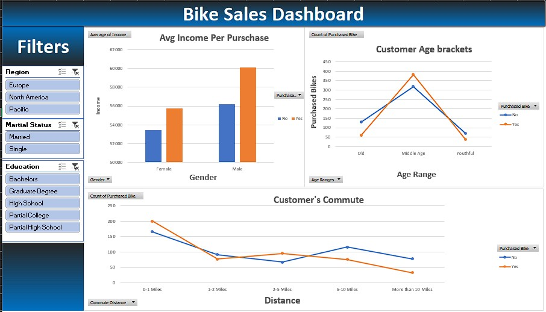

## Project demonstrated here was my Google's data analytics professional certificate capstone project

This data set was cleaned, analyzed and visualized using Excel.

### Final look at the dashboard:

This data has details of around 1000 users from different backgrounds and whether or not they purchased  a bike from the company that we want to make analysis for.

### Questions we are trying to ask are:
1. Who would try to purchase a bike? (trying to define the correlation between the age, income, gender with whether or not the customer has purchased a bike)
2. What can the company do to improve bike sales for different user's preferences?

### Overall process of the cleaning:

1. We will start off by removing the duplicates (data → remove duplicates)
2. the M and S indicators for married and Single under martial status might not be obvious to every user, so We want to change it to married and single explicitly. We want to Select the entire martial status column and press CTRL + H (make sure in the options menu, select search by columns, to keep range to that column only. Match Case if active, means look for exact match) and we replace M with married. And again S with single.
3. Same with gender, M → male, F → Female.
4. We will split the age column to ranges or segments for ease of use by inserting a new column called Age Ranges. Using if formula we can divide them to 3 ranges

    (age >= 55) → "Old"

    (55 > age >= 31) → "Middle Age"

    (age < 31) → "Youthful"

    We can use this If statement:

    =IF(L2>=55, "Old", IF(L2>=31, "Middle Age", IF(L2<31, "Youthful", "Invalid")))

    Now that our data is clean, we can proceed to the analysis.

5. We are going to create a pivot table (Insert → Pivot Table)
6. we are going to try to find out the relationship between income and gender with whether a person purchased  a bike or not through a clustered columns chart.
7. Adding a line with markers chart for Customer's Commute to show the relationship between the distance and number of people with purchased  bikes.
8. Adding a line with markers chart for Customer's Age to show the relationship between the age and number of people with purchased  bikes.

9. We are going to align the charts together in the dashboard sheet. And try to make the interface as clean and simple as possible for ease of use.
10. Now that we have our charts ready. We can add some slicers to the left of the dashboard and connect them to all pivot tables (Insert → Slicer). Then, choose which category will the slicer filter on. We can use right click on each slicer and select report connections and select all the pivot tables available. So the slicer works as a filter for all charts at the same time.
11. And here It's!. A dashboard that represents bike purchasers  from different regions and social lives. The user can interact with the dashboard through the filters and find correlations between different variables.

### Now let's make some data-driven decisions
As we can see, Men and women with higher income (60,123$),(56,208$) tend to purchase   a bike while Men and women with lower income   (55,774$), (53,440$). That means in order to increase bikes sales, the company should provide a cheaper bike option with similar quality. Or to provide a bike renting service for a suitable monthly subscription.

In regards to age, It's clear that Middle-age bracket is almost 4 times more likely to purchase   a bike than the more older or the youthful. This means that the company should provide more awareness   through advertising and marketing to how riding a bike can keep you fit whether you are still young or at an older age. This kind of awareness will encourage people to try and buy a bike to keep them self healthy and fit.

In regards  to the customer's commute distance. People tend to ride a bike for shorter distances, the bigger the distance, the fewer people tend to ride a bike. This is probably caused by two reasons. The first is that when someone finds out that he is going to travel more than 1 mile, he immediately chooses to ride his car or using public transportation. The second reason most probably is due to the lack of bike lanes in the road which keeps bike riders safe. The company can take two measures to solve this issue. Using advertising to spread awareness about how riding bikes keeps the environment  clean and reduces carbon dioxide   in the air, cars and buses produce lots of pollution and people can avoid this by riding their bikes to work or to their long commutes. The other solution can be to try to provide bike lanes for as many roads as possible to reduce accidents and to help bike riders get to their location quicker, avoiding traffic along the way.

And That's It!. I hope that you liked my project, and thank you so much for reading through till the end. If you need to ask me about anything related to the steps of creating this project or anything else :). Just feel free to contact me on my Email: Eng.Sameh.Abdelmoaty@Gmail.com

And I hope that you have a wonderful day.